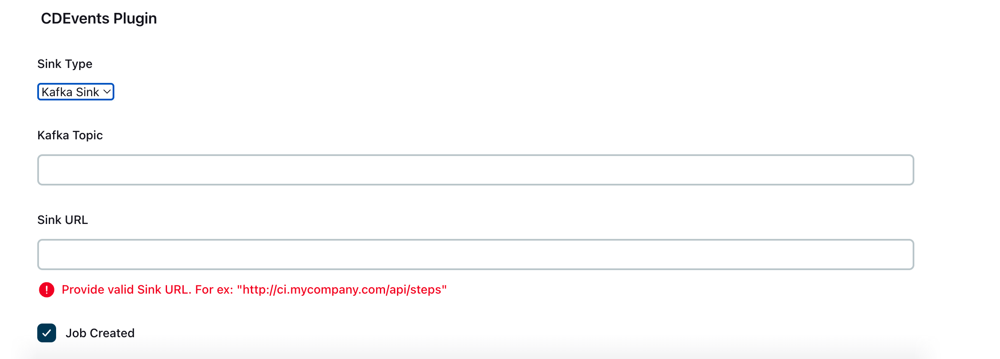

# Jenkins CloudEvents Plugin

This is a Jenkins plugin that integrates with CloudEvents. It provides functionality to send events related to the run of a job and to build and send CloudEvents to a specified sink.

## Getting Started

These instructions will get you a copy of the project up and running on your local machine for development and testing purposes.

### Prerequisites

- [Java](https://www.java.com/en/download/help/download_options.html) version 10 and above
- [Maven](https://maven.apache.org/install.html) version 3.9.4 and above
- [Jenkins](https://www.jenkins.io/doc/book/installing/) version 2.401.3 and above

### Installing

1. Clone the repository
2. Navigate to the project directory
3. Run `mvn clean install` to build the project
4. `mvn hpi:run` to run the plugin in Jenkins, you will have your instance running in ```localhost:8080/jenkins``` or ```127.0.0.1:8080/jenkins```.

## Usage

The plugin provides two main classes:

- [CurrentStage.java](./src/main/java/org/jenkinsci/plugins/cloudeventsSample/CurrentStage.java): This class handles the job model's status updates and determines whether to send a build event based on the event type and result.
- [HTTPSink.java](./src/main/java/org/jenkinsci/plugins/cloudeventsSample/Sinks/HTTPSink.java): This class is responsible for building and sending CloudEvents to a specified sink.
- [BuildModel.java](./src/main/java/org/jenkinsci/plugins/cloudeventsSample/models/BuildModel.java): This class represents the build model.
- [JobModel.java](./src/main/java/org/jenkinsci/plugins/cloudeventsSample/models/JobModel.java): This class represents the job model.
- [SCMState.java](./src/main/java/org/jenkinsci/plugins/cloudeventsSample/models/ScmState.java): This class represents the SCM state.


## Screenshot
### This Configuration Page look similar to this


### JSON Schema Received to Sockeye

